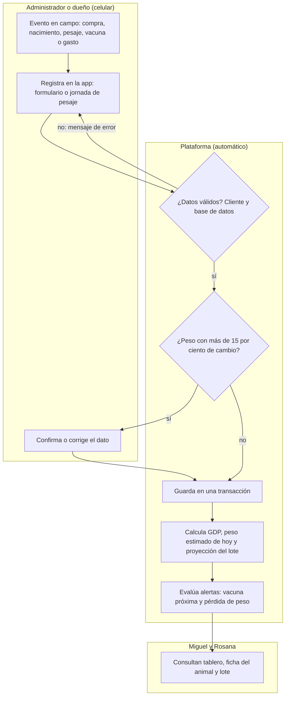
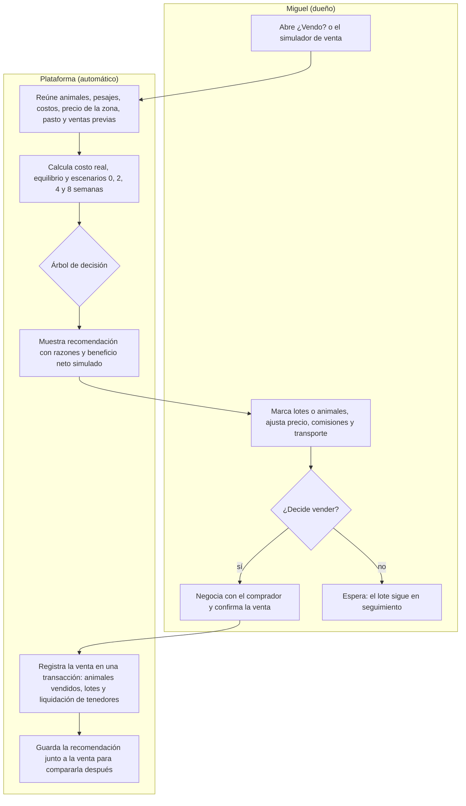
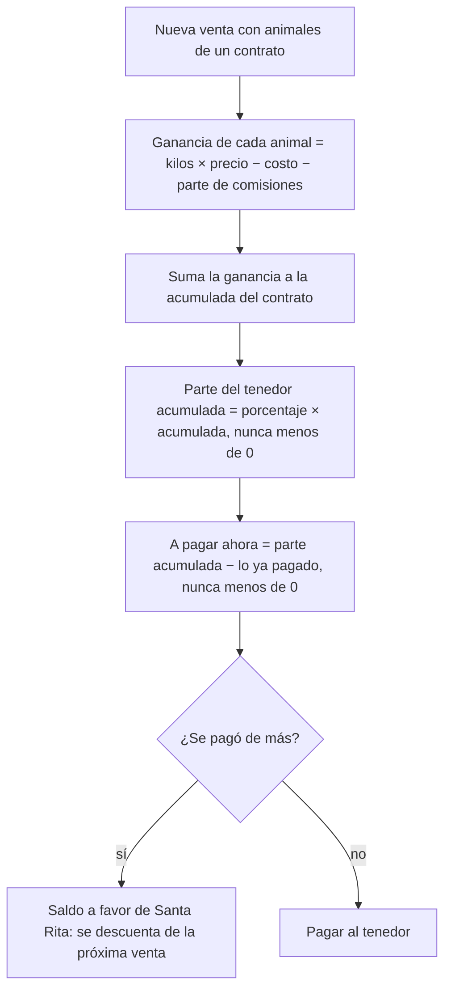
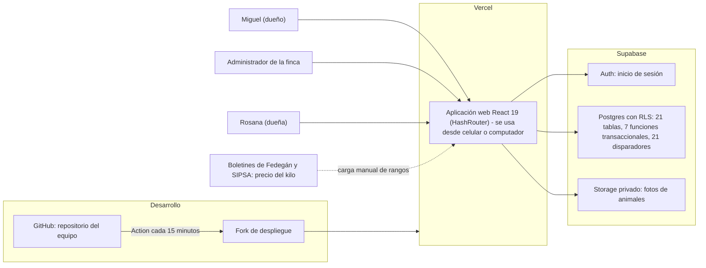
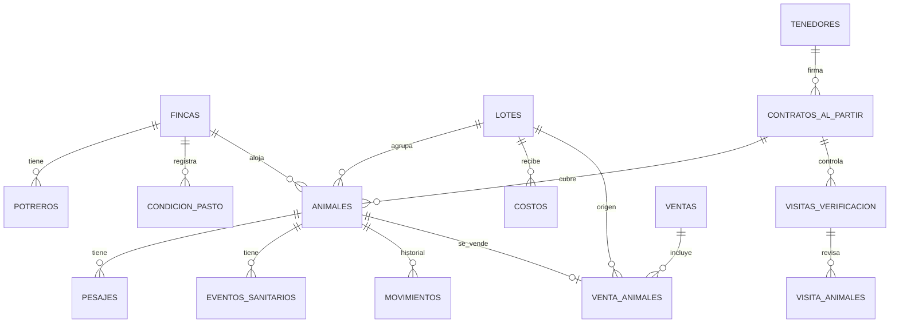

# Insumos para los capítulos 6, 7 y 8 del documento

Preparado el 2026-10-06 a partir del código y de la base de datos de producción (solo lectura),
en el estado del commit `9338270` (Sprint 06). Todo lo que aparece aquí se verificó en el código o
en la base de datos; lo que no se pudo verificar está marcado como **(verificar)**.

**Para qué sirve:** que quien escribe el documento tenga a la mano lo que la app hace de verdad,
con sus reglas, números y diagramas, y pueda corregir el capítulo 6 (y escribir el 7 y el 8) sin
prometer cosas que el MVP no tiene. El curso evalúa la **alineación entre el MVP y el diseño TO-BE**.

**Fuentes de verdad en el repositorio:** `docs/plan.md` (reglas D1–D12 y decisiones),
`src/domain/` (la lógica pura, con pruebas), `supabase/migrations/` (el esquema),
`specs/` (qué se pidió y cómo se aceptó), `sprints/` (la bitácora) y
`reports/verificacion/` (los informes del verificador).

---

## 1. Lo que el capítulo 6 (versión 2) dice y el MVP no hace

| El capítulo dice | Lo que hay en el MVP | Cómo escribirlo |
|---|---|---|
| TRM y pronóstico de lluvia por API diaria (F6, RN-09, RN-10, carril "Fuentes externas") | **No existe.** Se retiraron en el Sprint 05 por pedido de Miguel y de Juan ("simplificar", "quitar el clima"). El riesgo de pasto lo registra Miguel con un semáforo (verde, amarillo, rojo). | Fase 2, con la razón: decisión del cliente tras usar la app. Es evidencia de validación con el cliente. |
| Registro y sincronización sin conexión (F2, 6.6.3) | **No existe.** La app requiere conexión (decisión del proyecto). No hay service worker. | Quitarlo o marcarlo Fase 2. |
| Notificaciones cuando cambia la recomendación | **No existe.** Hay **alertas en el tablero**: vacunas programadas a ≤ 15 días y animales que pierden peso. | Escribir "alerta visible en el tablero", no "notificación". |
| Recálculo diario automático | **No existe tarea programada.** Todo se calcula al consultar, con los datos del momento. | "Se recalcula en cada consulta". |
| "Calibra el histórico con cada venta" | La venta queda guardada **con la recomendación que tenía el sistema** y se compara después (margen esperado contra real). **No** recalibra umbrales solo. | "Registra y compara"; la recalibración es manual. |
| Tiempo de retiro de tratamientos (RN-05) y dosis (F4) | La tabla `eventos_sanitarios` guarda tipo (vacuna, tratamiento, desparasitación), descripción, estado (programado o aplicado) y fechas. **No hay campos de dosis ni de tiempo de retiro**; ese texto va en la descripción. | RN-05 pasa a Fase 2. |
| Alerta de vacuna a ≤ 7 días | La alerta del tablero es a **≤ 15 días**. | Corregir el umbral. |
| Dato desactualizado a los 45 días (RN-02) | No encontré un umbral de 45 días en el código. La página Indicadores muestra los días desde el último pesaje de cada lote. **(verificar)** | Describir lo que muestra Indicadores. |
| Reglas de venta: "lote listo ≥ 80 %", "precio ≥ promedio de 90 días", "esperar 30 días" | **No son las reglas implementadas.** Ver la sección 3. | Reescribir 6.6 con la sección 3. |
| Rosana con rol de solo lectura | La base de datos tiene **dos roles** (`dueno`, `administrador`). Hoy cualquier miembro con perfil activo lee, crea y edita; **solo el dueño borra**. No existe un rol de solo lectura. | Corregir la tabla 6.5. |
| 140 reses, 49.000 kg, $58,8 millones | Las 140 reses son los **datos de demostración** del equipo. En el audio del equipo, Miguel empezaría con unas 20. | Marcar la sensibilidad como ilustrativa o recalcularla con datos reales. |
| "$1.200 por kilo = ≈ 10 % del valor" | Con los rangos que cargamos ($7.000 a $10.500 por kilo, **estimados, por validar**), $1.200 es entre 11 % y 17 %. | Revisar de dónde sale el dato. |

**Lo que existe y el capítulo casi no menciona** (y es lo más valioso): costo real por animal y por
lote, liquidación acumulada de tenedores, simulador de venta con comisiones y venta de varios lotes,
vientres que no se venden, precio por categoría y zona, caballos, fotos, importación desde Excel,
página de indicadores y validaciones en la base de datos.

---

## 2. Funcionalidades del MVP (para reemplazar la tabla 6.4)

| # | Funcionalidad | Qué hace | Problema del AS-IS que resuelve | Estado | Código |
|---|---|---|---|---|---|
| F1 | Hoja de vida del animal | Ficha con marca, nombre con número (Luna-042), chapeta ICA, sexo, categoría, raza, nacimiento, dueño, color, foto, tres pesos (inicial, actual, objetivo), compra por kilo o por animal, ubicación y esquema. Editar, dar de baja (muerte o pérdida) y eliminar (error de registro). | Registros en papel y WhatsApp sin asociar a un animal | **Sí** | `AnimalDetail.jsx`, `AnimalForm.jsx`, `registrar_animal` |
| F2 | Pesaje | Pesaje individual o jornada por lote; validación de variación mayor al 15 %; GDP total y reciente; peso estimado de hoy. Requiere conexión. | Reconstruir el peso exige un día de pesaje | **Sí** (sin modo sin conexión) | `Pesaje.jsx`, `gdp.js` |
| F3 | Proyección de peso y de lote | Fecha estimada de llegada a la meta (promedio de los pesos objetivo de los animales del lote) y avance. | Sin proyección | **Sí** | `lotes.js` |
| F4 | Sanidad | Registrar vacunas, tratamientos y desparasitaciones, aplicadas o programadas; alerta en el tablero a ≤ 15 días. | Sanidad "al aire" | **Parcial** (sin dosis ni retiro) | `AnimalDetail.jsx`, `Dashboard.jsx` |
| F5 | Gestión "Al partir" | Tenedores, contratos (animales, precio, porcentaje), visitas de verificación con pesaje y animal no encontrado, liquidación acumulada de cada contrato. | Control sin respaldo documentado | **Sí** | `AlPartir.jsx`, `decision.js`, `registrar_visita` |
| F6 | Costos | Gastos por animal, por lote o de la finca entera, con categoría; costo acumulado y punto de equilibrio. | Costo no consolidado | **Sí** | `costos.js`, `Costos.jsx` |
| F7 | Precio de la zona | Rangos por kilo para 5 categorías (ternero, ternera, levante, gordo, vaca), editables por Miguel. Valores iniciales **estimados por el equipo, por validar**. | 3+ fuentes consultadas a mano | **Parcial** (carga manual, sin API) | `precios.js`, `Market.jsx` |
| F8 | Motor de recomendación | Ver sección 3. | Decisión por intuición | **Sí** | `decision.js` |
| F9 | Simulador y registro de venta | Marca lotes o animales, precio, comisiones y transporte; muestra valor bruto, costos, parte de tenedores, beneficio neto y margen; guarda **una venta con varios lotes**. | Sin simulación ni cierre del ciclo | **Sí** | `Ventas.jsx`, `registrar_venta` |
| F10 | Indicadores y reporte | Página de indicadores del proyecto frente a la línea base; reporte imprimible por lote. | Sin medición | **Sí** | `Indicadores.jsx`, `Report.jsx`, `kpis.js` |
| F11 | Importar censo | Carga de animales desde CSV (hoja de Excel). | Carga inicial lenta | **Sí** | `ImportarCenso.jsx`, `censo.js` |
| F12 | Caballos y fotos | Registro y venta de caballos aparte; foto cuadrada (800 px y miniatura de 200 px) en almacenamiento privado. | Pedido de Miguel y Juan | **Sí** | `FichaAcciones.jsx`, `fotos.js` |

---

## 3. Reglas de negocio reales (para reemplazar 6.6)

### 3.1 Tabla de reglas

| ID | Regla | Valor | Efecto | Código |
|---|---|---|---|---|
| RN-01 | Pesaje sospechoso | Cambio mayor al 15 % frente al último peso | Se advierte antes de aceptar; en una visita "Al partir" se lista como sospechoso | `gdp.js` `variacionSospechosa` |
| RN-02 | Animal que pierde peso | GDP del último período negativa (período de al menos 14 días) **o** caída de más de 8 kg desde su máximo de los últimos 30 días | Alerta en el tablero | `gdp.js` `pierdePeso` |
| RN-03 | Estado del pasto | Semáforo registrado por Miguel (verde, amarillo, rojo), por finca o potrero; vigente 30 días; si hay varios, vale el más crítico | Rojo activa la venta anticipada | `pasto.js` |
| RN-04 | Los vientres no se venden | Categorías vientre menor, mayor y parida | Se excluyen del cálculo y la base de datos rechaza venderlos | `decision.js`, trigger `venta_animales_permitida` |
| RN-05 | Costo acumulado de un animal | Compra + gastos directos + parte de los gastos del lote (a partes iguales entre los animales que estaban activos en el lote en la fecha del gasto) | Base del equilibrio | `costos.js` |
| RN-06 | Punto de equilibrio | Costo total del lote ÷ kilos vendibles (con destare) | Se muestra en $/kg | `decision.js` |
| RN-07 | Precio por animal | Punto medio del rango de su categoría de precio. Novillo y reproductor: **levante** si pesa menos de 350 kg, **gordo** desde 350 kg; vientres: vaca. Respaldo: último precio manual | Precio de la simulación | `precios.js` |
| RN-08 | Escenarios de espera | Vender hoy y esperar 2, 4 y 8 semanas. Cada animal gana peso a su propia GDP; el gasto diario es el promedio de los últimos 90 días | Margen neto de cada escenario | `decision.js` |
| RN-09 | Sensibilidad del precio | Precio −10 %, −5 %, +5 % y +10 % | Margen de cada variante | `decision.js` |
| RN-10 | Destare | Entre 0 y 15 % (restricción en la base de datos); valor inicial 0 % por validar | Reduce los kilos pagados | tabla `parametros` |
| RN-11 | Liquidación "Al partir" | El tenedor recibe su porcentaje de la **ganancia neta acumulada del contrato**, menos lo ya pagado, nunca menos de $0; lo pagado de más queda como **saldo a favor** de Santa Rita | Pago de cada venta | `decision.js` `partesTenedores` |
| RN-12 | Comisiones y transporte | Se reparten entre los animales en proporción a su valor bruto y se restan **antes** de calcular la parte del tenedor | Margen neto | `decision.js` `repartirGastosVenta` |
| RN-13 | Visita "Al partir" | Animal marcado como no encontrado, o peso con más del 15 % de diferencia frente al último | Queda registrado como discrepancia | `AlPartir.jsx`, `registrar_visita` |
| RN-14 | Fechas | Ninguna fecha puede ser futura; la venta no puede ser anterior al ingreso; el nacimiento no puede ser posterior al ingreso | Rechazo en el cliente y en la base de datos | triggers y restricciones |
| RN-15 | Identificación única | El nombre del animal y la chapeta no se repiten (sin distinguir mayúsculas ni espacios) | Rechazo con mensaje claro | índices únicos |
| RN-16 | Alerta sanitaria | Evento programado con fecha dentro de los próximos 15 días, o vencido | Aviso en el tablero | `Dashboard.jsx` |

### 3.2 Árbol de decisión de la recomendación (en este orden)

| Orden | Condición | Recomendación | Qué explica el sistema |
|---|---|---|---|
| 1 | No hay precio o no hay animales vendibles | **Sin datos** | Pide registrar el precio en "Precio y pasto" |
| 2 | Margen de vender hoy ≤ 0 | **No vender** | Pérdida de vender hoy y, si algún escenario deja margen positivo, en cuántas semanas |
| 3 | Peso promedio ≥ meta (promedio de los pesos objetivo) | **Vender** | Margen; si esperar diera más, cuánto más (solo si el comprador acepta animales más pesados) |
| 4 | Pasto en rojo | **Vender anticipado** | Margen de hoy y cuánto se deja de ganar frente a esperar |
| 5 | El mejor escenario futuro tiene más margen que hoy | **Esperar** | "Esperar N semanas subiría el margen de $X a $Y" |
| 6 | Esperar ya no sube el margen | **Vender** | "Esperar ya no paga"; avisa si no llegó a la meta y pide confirmar con el comprador |

Equivalencia con los escenarios del capítulo 6.6.2: "datos insuficientes" = 1; "venta con pérdida" = 2;
"lote listo" = 3; "riesgo climático" = 4; "esperar" = 5 y 6. El mercado ya no entra como regla: entra
como precio de la zona y como sensibilidad.

---

## 4. Diagramas (Mermaid)

GitHub los dibuja solos. Para pegarlos en Word: copiar el bloque en https://mermaid.live y exportar
como PNG o SVG.

### 4.1 Proceso A: registro y trazabilidad

### 4.2 Proceso B: decisión y registro de la venta

### 4.3 Liquidación "Al partir" (acumulada)

### 4.4 Arquitectura y ecosistema

### 4.5 Modelo de datos (simplificado)

---

## 5. Modelo de datos y seguridad (para el capítulo 7)

**21 tablas**, todas con RLS activado (4 políticas por tabla; `parametros` 2 y `perfiles` 1).

| Grupo | Tablas |
|---|---|
| Hato | `animales`, `pesajes`, `jornadas_pesaje`, `eventos_sanitarios`, `movimientos` |
| Estructura | `lotes`, `fincas`, `potreros`, `condicion_pasto` |
| "Al partir" | `tenedores`, `contratos_al_partir`, `visitas_verificacion`, `visita_animales` |
| Dinero | `costos`, `ventas`, `venta_animales`, `ventas_equinos` |
| Mercado y parámetros | `precios_referencia`, `precios_mercado`, `parametros` |
| Acceso | `perfiles` |

**Funciones transaccionales (RPC):** `registrar_animal`, `registrar_venta`, `vender_equino`,
`registrar_visita`, `asignar_a_contrato`, `mover_animales`, `guardar_finca`. Cada una hace todo o
nada en una sola transacción y se ejecuta con los permisos de quien llama.

**Disparadores (21)** que validan en la base de datos: fechas no futuras, orden de los movimientos,
vientres y caballos no vendibles, pesajes solo de bovinos, bajas coherentes, un animal solo en un
contrato vigente, etc. Dos funciones del esquema privado, `es_miembro` y `es_dueno`, deciden quién
puede leer, escribir y borrar.

**Gobierno y seguridad (7.6):**
- Solo entra quien tiene un perfil activo (`perfiles`). Roles: `dueno` y `administrador`. Solo el dueño borra.
- Las validaciones están en el cliente **y** en la base de datos; la interfaz sola no es la barrera.
- La llave de servicio nunca está en el cliente; el sitio solo lleva la URL y la llave publicable.
- Fotos en un bucket privado con URLs firmadas que duran una hora.
- Las pruebas automáticas y la carga de datos de ejemplo se **niegan** a correr contra producción (`scripts/proyectos.mjs`).
- Pendiente (anotado en `DEPLOY.md`): desactivar el registro público y activar la protección de contraseñas filtradas en Supabase.
- Quién mantiene la solución: el equipo del proyecto (administrador técnico) hasta la entrega; después, la cuenta de Miguel como dueño de los datos. **(Definirlo con el cliente.)**

---

## 6. Ejemplos numéricos (calculados con las funciones reales de la app)

Son **datos de demostración**, no datos de Miguel. Se calcularon el 2026-10-06 ejecutando
`analizarLoteV2`, `resultadoVenta` y `simularVenta` de `src/domain/decision.js`.

### 6.1 Recomendación de un lote

**Entradas:** 4 novillos comprados el 7 de julio a $2.500.000 cada uno (280, 290, 285 y 275 kg); hoy
pesan 370, 380, 372 y 365 kg (≈ 1 kg por día). Gastos del lote: suplemento $1.200.000 (15 de agosto)
y sal mineral $400.000 (10 de septiembre). Precio de la zona para "gordo": $8.000 a $9.400, punto
medio $8.700. Destare 0 %. Meta 450 kg por animal. Fecha: 5 de octubre.

| Concepto | Valor |
|---|---|
| Peso promedio hoy / avance a la meta | 371,75 kg / 83 % |
| Valor bruto de vender hoy (1.487 kg × $8.700) | $12.936.900 |
| Costo total (compra $10.000.000 + gastos $1.600.000) | $11.600.000 |
| Punto de equilibrio | $7.801 por kilo |
| **Margen neto de vender hoy** | **$1.336.900** |
| Margen esperando 2 / 4 / 8 semanas | $1.571.192 / $1.805.483 / $2.274.067 |
| **Recomendación** | **ESPERAR**: "Esperar 8 semanas subiría el margen de $1.336.900 a $2.274.067: los animales ganan más de lo que cuesta mantenerlos." |

**Sensibilidad del precio:** −10 % → $43.210; −5 % → $690.055; +5 % → $1.983.745; +10 % → $2.630.590.
Una baja del 10 % en el precio casi borra el margen; es un buen argumento para el capítulo 6.8.

**Mismo lote con el pasto en rojo:** la recomendación cambia a **VENDER ANTICIPADO**: "El pasto está en
rojo: se recomienda anticipar la venta mientras el margen es positivo ($1.336.900)... deja de ganar hasta
$937.167 frente a esperar 8 semanas".

### 6.2 Liquidación acumulada de un tenedor (contrato al 50 %, precio $8.000 por kilo)

| Venta | Animal | Ingreso | Costo | Ganancia | Acumulada | Parte del tenedor acumulada | Ya pagado | **A pagar** | Saldo a favor |
|---|---|---|---|---|---|---|---|---|---|
| 1 (1 oct) | 380 kg | $3.040.000 | $2.000.000 | $1.040.000 | $1.040.000 | $520.000 | $0 | **$520.000** | $0 |
| 2 (5 oct) | 300 kg | $2.400.000 | $2.800.000 | −$400.000 | $640.000 | $320.000 | $520.000 | **$0** | **$200.000** |

La pérdida del segundo animal descuenta lo que ganaron los demás del mismo contrato, aunque se
vendan en ventas distintas.

### 6.3 Simulador con transporte

Un animal de 300 kg (costo $1.000.000) y otro de 350 kg (costo $1.500.000), a $8.000 por kilo, con
$300.000 de comisiones y transporte: peso total 650 kg; valor bruto $5.200.000; costos $2.500.000;
comisiones $300.000; **beneficio neto $2.400.000, 46,2 % del valor bruto**.

---

## 7. Evidencia que se puede citar

- **Calidad:** 199 pruebas unitarias de la lógica de negocio (17 archivos); 23 especificaciones
  con requisitos numerados; informes de verificación independiente por spec en `reports/verificacion/`
  (máximo 2 rondas por spec); 21 disparadores y restricciones en la base de datos.
- **Método ágil (capítulo 3 y 6):** 7 sprints (0 a 6) con plan, bitácora, verificación, retro y deuda en
  `sprints/`; flujo de especificación, aprobación humana, implementación y verificación.
- **Validación con el cliente:** `docs/retroalimentacion.md` registra más de 30 peticiones de Miguel,
  Juan y el equipo, cada una con su estado y la spec que la resolvió. Cambios grandes que salieron de ahí:
  menú de 4 botones, letra y botones grandes (Miguel tiene 60 años), quitar clima y TRM, dueño por animal,
  vientres no vendibles, caballos, fotos, gastos de finca y simulador de venta por lotes.
- **Capturas** para el documento: `reports/verificacion/sprint05-capturas/` (y se pueden tomar
  nuevas de la versión en https://santa-rita-app-1.vercel.app).
- **Despliegue:** https://santa-rita-app-1.vercel.app (Vercel); instrucciones en `README.md` y `DEPLOY.md`.

---

## 8. Cómo reescribir cada sección

| Sección | Qué cambiar |
|---|---|
| **6.1 / 6.2** | Reemplazar los diagramas por los de la sección 4 (A: registro; B: decisión de venta). Agregar el de "Al partir" (4.3). Quitar el carril "Fuentes externas" con TRM y clima. |
| **6.3** | Mantener la tabla. Cambiar: TRM y clima pasan a Fase 2; "precio del kilo" queda **semiautomático** (Miguel carga los rangos); agregar costos, simulador y liquidación. Sumar una "tasa de automatización" (actividades automáticas ÷ total). |
| **6.4** | Usar la tabla de la sección 2, con la columna de estado. |
| **6.5** | Roles reales: dueño, administrador; Rosana es dueña, pero hoy sin rol de solo lectura. Agregar una matriz de permisos por función (por ejemplo, solo el dueño borra). |
| **6.6** | Usar las secciones 3.1 y 3.2. Citar las pruebas unitarias como evidencia. Quitar el flujo sin conexión. |
| **6.7** | Ver la propuesta de KPIs de abajo. |
| **6.8** | Agregar los ejemplos de la sección 6 y la sensibilidad del precio. Declarar que el ahorro no está garantizado; lo que se mide es el margen real contra el esperado. |
| **Cap. 7** | Secciones 4.4, 4.5 y 5. En 7.3, aclarar que no hay integración con ICA, SINIGAN ni Fedegán (alcance 1.4.2); el precio se carga manualmente. |
| **Cap. 8** | Ver la sección 9. |

### KPIs propuestos (los que la app ya puede medir)

| KPI | Línea base (AS-IS) | Cómo se mide | Dónde se lee |
|---|---|---|---|
| Animales con historial de peso (≥ 2 fechas) | 0 % | Animales con ≥ 2 pesajes ÷ animales activos | Página Indicadores |
| Días desde el último pesaje de cada lote | Cada ≈ 30 días | Fecha del último pesaje | Página Indicadores |
| Registro digital completo (nombre y chapeta) | 0 % | Animales con ambos datos ÷ activos | Página Indicadores |
| Tiempo para conocer el estado de un lote | ≈ 1 día | **Cronometrar** con un usuario | Medición manual |
| Tiempo de registro de un animal / de un pesaje | No medido | **Cronometrar** | Medición manual |
| Tiempo para preparar una decisión de venta | Consulta manual de 3+ fuentes | **Cronometrar** el simulador | Medición manual |
| Ventas con recomendación guardada y cuántas la siguieron | No existe reporte | Ventas con recomendación ÷ ventas | Página Indicadores |
| **Margen real contra margen esperado** (reemplaza la "pérdida por TRM") | No medido | Diferencia en el detalle de cada venta | Detalle de la venta |
| Visitas "Al partir" registradas con discrepancias detectadas | 0 casos documentados | Visitas registradas | Detalle del contrato |
| Personas que usan el sistema en el mes | 1 | Usuarios activos | Supabase Auth |

---

## 9. Capítulo 8: lo que hay y lo que falta

**Ya existe:**
- MVP funcional desplegado; código en GitHub con historial de commits por spec.
- `README.md` y `DEPLOY.md` (base para 8.4).
- Pruebas: `npm test` (199) y `npm run test:e2e` (necesita un proyecto de pruebas).

**Falta:**
1. **Video de 5 a 10 minutos.** Guion sugerido: registrar un animal con foto y los tres pesos; ver la ficha y la GDP; ver el lote en la página de animales; consultar ¿Vendo? (recomendación con razones); simular la venta de dos lotes con transporte; mostrar la liquidación de un tenedor en "Al partir"; mostrar Indicadores. Usar **datos de demostración**, nunca datos reales de Miguel.
2. **Proyecto de Supabase de pruebas** (DT-05-1) para que un tercero reproduzca el MVP: crear el proyecto, aplicar las migraciones de `supabase/migrations/`, copiar `.env.example` a `.env.local` con la URL y la llave publicable, `npm install` y `npm run dev`. Los datos de ejemplo se cargan con `npm run db:seed` (solo contra el proyecto de pruebas). Detalle en `DEPLOY.md`.
3. **Datos de demostración** en ese proyecto para grabar el video y las capturas.

---

## 10. Información que tienen que conseguir ustedes

| Qué | Para qué | Quién |
|---|---|---|
| Retroalimentación del profesor a la entrega 1 y fecha límite | Corregir los capítulos 1 a 5 | Equipo |
| Decisión: TRM y clima como Fase 2 en el documento | Alinear los capítulos 1, 2, 5 y 6 con el MVP | Equipo (recomendado: sí) |
| Tiempos cronometrados (ver KPIs) con Miguel o el administrador, 5 repeticiones por tarea, siempre en el mismo celular | Reemplazar las metas por mediciones | Equipo con Miguel |
| Tamaño real del hato, cuántos lotes vende por año, destare real y precio por kilo de la última venta | Recalcular la sensibilidad con datos reales | Miguel |
| Origen del dato de $1.200 por kilo = 10 % | Validar la línea base | Quien lo escribió en la entrega 1 |
| Validación de los umbrales: 15 % de variación de peso, 14 días de período mínimo, 30 días de vigencia del pasto, 15 días de alerta sanitaria | Dejar de llamarlos "por validar" | Miguel |
| Validación de los rangos de precio por categoría (hoy estimados por el equipo) | Que el precio de la zona sea real | Miguel |
| Quién será el dueño de la plataforma tras la entrega | Gobierno (7.6) | Miguel y el equipo |
| Cuenta real de Miguel (hoy hay correos de ejemplo) | Demostración y piloto | Equipo |

**Cuidado con estas frases** (no las pueden afirmar hoy): "notificaciones", "sincroniza sin conexión",
"actualiza TRM y clima todos los días", "calibra los umbrales con cada venta", "controla el tiempo de retiro".
